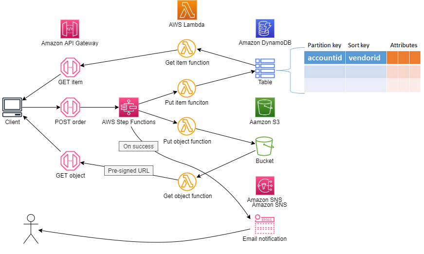
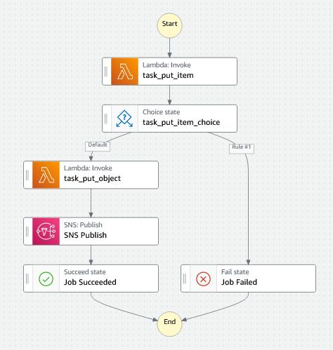

## Example
This example is designed for a concept mobile application called Skip the Line, which allows a user to pre-order takeaway coffee while they are in transit. Just as the train pulls into the station, the user can order a coffee and pick it up on the way past the coffee shop.

In this example the AWS Step Function service uses a state machines to orchestrate the execution of AWS Lambda functions. A client sends a request to an Amazon API Gateway which in turn passes that request to the Step Function service. Included in the request sent to the Step Function service is the body of information to be processed and the state machine to be executed. The state machine begins by calling a Lambda function which writes input to a DynamoDB table. If that operation is successful the state machine calls the next function which writes the input as an object to an Amazon S3.

The AWS Step Function service allows to you design and run an orchestrated workflow. It is really helpful when your application needs to execute events in a specific order. In this example we commit the order first to DynamoDB, once this has happened the next step generates the invoice and writes it to an S3 bucket. If the first step is unsuccessful the second step will not execute.

The Amazon DynamoDB table is partitioned on an ```accountid``` attribute and also includes a sort key on the ```vendorid``` attribute, together they form the unique primary key. The combination of these keys ensures that customer can only have one active order for each vendor. After the order is processed the item would be removed from the table, similar behaviour to a shopping cart.




**AWS Step Functions state machine**



## Setup

You will need to download and install [Node.js](https://nodejs.org/en/download/) before you can start using the AWS Cloud Development Kit.

This example is developed using the AWS CDK and Typescript, so you will need to install both Typescript and the CDK using the following commands
```
npm install -g typescript
npm install -g aws-cdk@latest
```
Since this CDK project uses ['Assests'](https://docs.aws.amazon.com/cdk/latest/guide/assets.html), you might need to run the following command to provision resources the AWS CDK will need to perform the deployment.

```bash 
cdk bootstrap
```

The testing scripts can be executed using Jupyter Notebook. There are a few methods for installing Jupyter Notebooks. These instructions will help you get to started with [JupyterLab](https://jupyter.org/install) installation. 

You can also install Jupyter Notebooks as part of [Anaconda](https://docs.anaconda.com/anaconda/install/index.html) installation.

To download this example, you will need to install [Git](https://github.com/git-guides/install-git). After installing git follow these [instructions](https://github.com/git-guides/git-clone) to learn how to clone the repository.

After the repository has been cloned set the command prompt path to the cloned directory and run the following command to install the project dependencies.

```bash
npm install
```

**cdk synth** executes the application which translates the Typescript code into an AWS CloudFormation template.

```bash
cdk synth
```

After the synth command has generated the template use the  **cdk deploy** command to deploy the template to AWS CloudFormation and build the stack. You will be prompted to confirm the deployment with y/n.

```bash
cdk deploy
```
## Test the Stack
We need to install Jest since we are using the Jest framework to test the stack. Testing the stack is optional.
```
npm install --save-dev jest @types/jest @aws-cdk/assert
```

## Run the Example
Open the Jupyter Notebook in the **jupyter_notebook directory** follow the instructions.

## Cleanup
From the command prompt execute the following command: **cdk destroy**

## Deployed Resources
|	Identifier	|	Service	|	Type	|
|	:---	|	:---	|	:---	|
|	StepFunctionOrchestration-CustomS3AutoDeleteObject-…	|	Lambda	|	Function	|
|	StepFunctionOrchestration-CustomS3AutoDeleteObject-…	|	IAM	|	Role	|
|	step_function_orchestration	|	DynamoDB	|	Table	|
|	step_function_orchestration_lambda_put_object	|	IAM	|	Role	|
|	step_function_orchestration	|	StepFunctions	|	StateMachine	|
|	restapis/id	|	ApiGateway	|	RestApi	|
|	account/StepFu-apigw-…	|	ApiGateway	|	Account	|
|	StepFunctionOrchestration-apigwCloudWatchRole…	|	IAM	|	Role	|
|	step_function_orchestration_get_item	|	Lambda	|	Function	|
|	step_function_orchestration_get_object	|	Lambda	|	Function	|
|	step_function_orchestration_put_item	|	Lambda	|	Function	|
|	step_function_orchestration_put_object	|	Lambda	|	Function	|
|	step_function_orchestration_api	|	IAM	|	Role	|
|	step_function_orchestration_get_item	|	IAM	|	Role	|
|	step_function_orchestration_lambda_get_object	|	IAM	|	Role	|
|	step_function_orchestration_put_item	|	IAM	|	Role	|
|	step_function_orchestration_statemachine	|	IAM	|	Role	|
|	step_function_orchestration_topic	|	SNS	|	Topic	|
|	stepfunctionorchestratio-stepfunctionorchestratio-…	|	S3	|	Bucket	|
